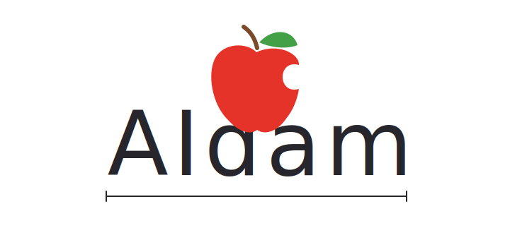

# AIDAM

An open fact-checking agent. Instead of trusting what a model remembers, AIDAM
retrieves live evidence from many sources and lets a small specialized model
compare it against the claim. Every verdict cites its sources.

## How it works

1. **Decomposes** the claim into verifiable facts.
2. **Retrieves** evidence in parallel: Wikipedia (in several languages via
   interlanguage links), the open web, Wikinews, Stack Overflow, Semantic
   Scholar, OpenAlex, arXiv and Europe PMC, plus a search aimed specifically
   at fact-checkers. A router picks sources based on the claim's topic.
3. **Judges** each (fact, passage) pair with a multilingual 280M-parameter NLI
   verifier trained for this task.
4. **Aggregates** with explicit, auditable rules: one domain is one voice,
   fact-checkers and academia weigh more, repeating the claim does not count
   as evidence, and misread debunking articles are discounted.
5. Returns the verdict — **supported / refuted / conflicting evidence /
   not enough evidence** — with the citations that justify it.

Optional: MiMo-7B-RL (quantized, running locally in an isolated process)
generates search questions to guide retrieval and detects claims that mislead
by omission.

## Usage

```bash
git clone https://github.com/DeliVali/AIDAM.git && cd AIDAM
uv venv --python 3.12
uv pip install -e ".[verificador]"
.venv/bin/aidam verificar "The Eiffel Tower is in Paris" --lang en
```

Runs on GPU, on CPU without PyTorch (`aidam[verificador-cpu]`, ONNX Runtime),
or on low-RAM machines (319 MB quantized model, `AIDAM_BACKEND=onnx-mini`).
The model is published on
[HuggingFace](https://huggingface.co/DeliVali/aidam-verificador).

## Technology

- **Verifier**: mDeBERTa-v3 (280M) fine-tuned on VitaminC, MNLI and our own
  synthetic data. PyTorch for training; ONNX Runtime for CPU; weight-only
  quantization (block-wise int4 + int8 embeddings) for the mini variant.
- **Local LLM**: MiMo-7B-RL (Xiaomi) as GGUF Q4 via llama.cpp.
- **Continuous evaluation**: AVeriTeC (real-world claims with annotated
  verdicts); every change to the system is measured before it lands.

## Status

62% accuracy on AVeriTeC-500 (evaluated against the shared task's official
knowledge store) at 11.2 s per claim, with a ~280M-parameter verifier core —
above the benchmark's 61% majority baseline. Against the same reasoning LLM
without retrieval: +37 accuracy points. Numbers, architecture and roadmap
live in [docs/](docs/).

## Contributing

Apache 2.0 license — © 2026 [Jeffrey Romero Del Val](https://github.com/DeliVali).
Free to use, modify and redistribute; keep the [NOTICE](NOTICE) attribution.
Contribution guide in [CONTRIBUTING.md](CONTRIBUTING.md); code of conduct in
[CODE_OF_CONDUCT.md](CODE_OF_CONDUCT.md).
