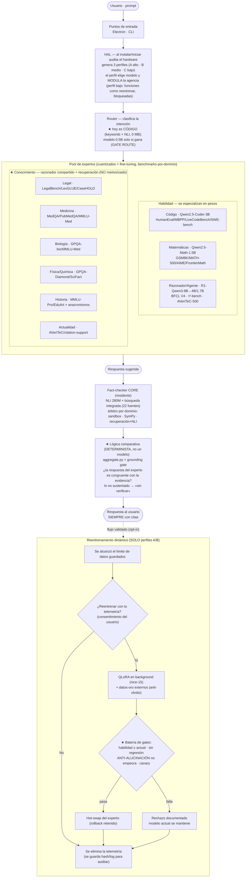
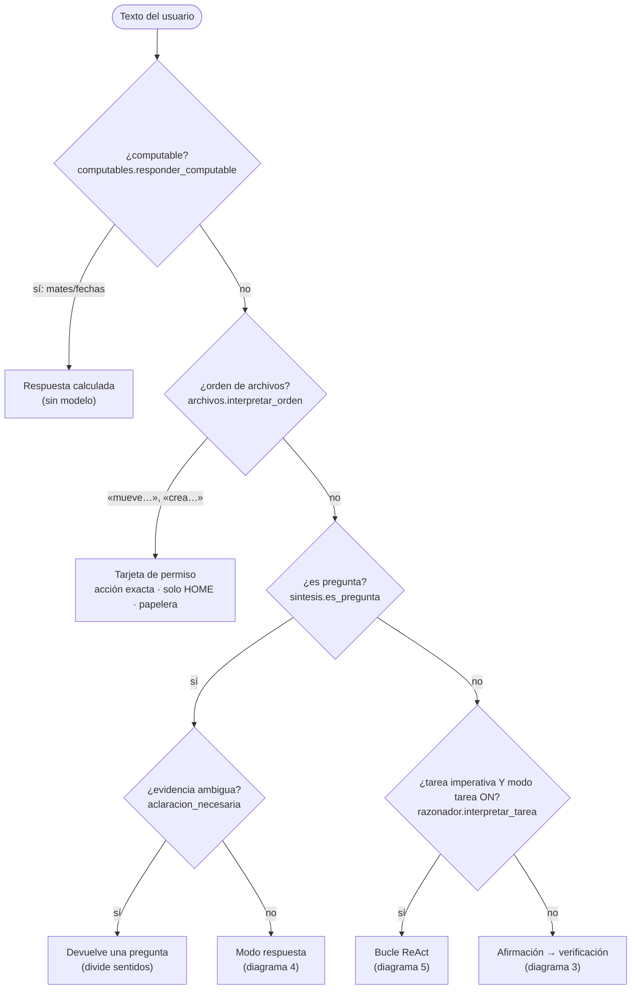
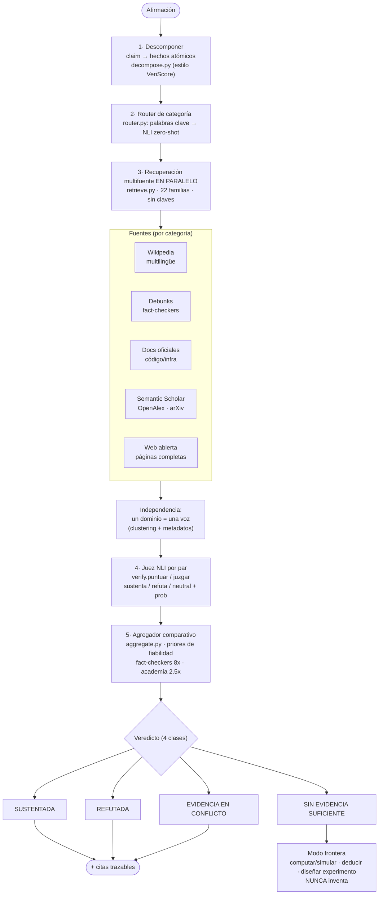
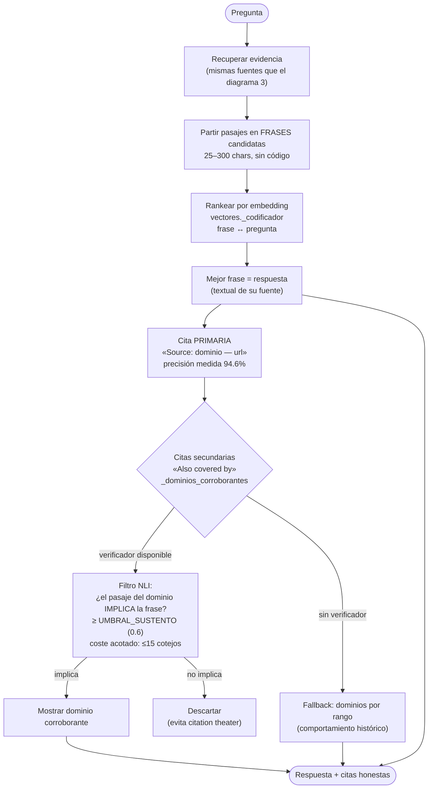
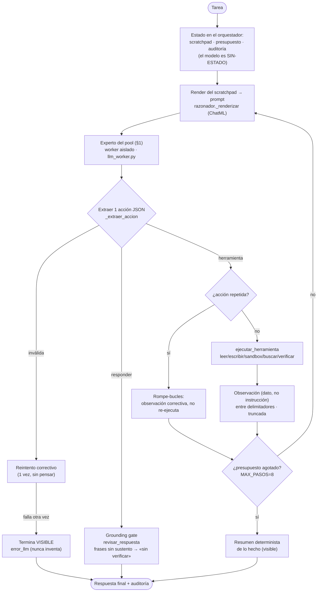
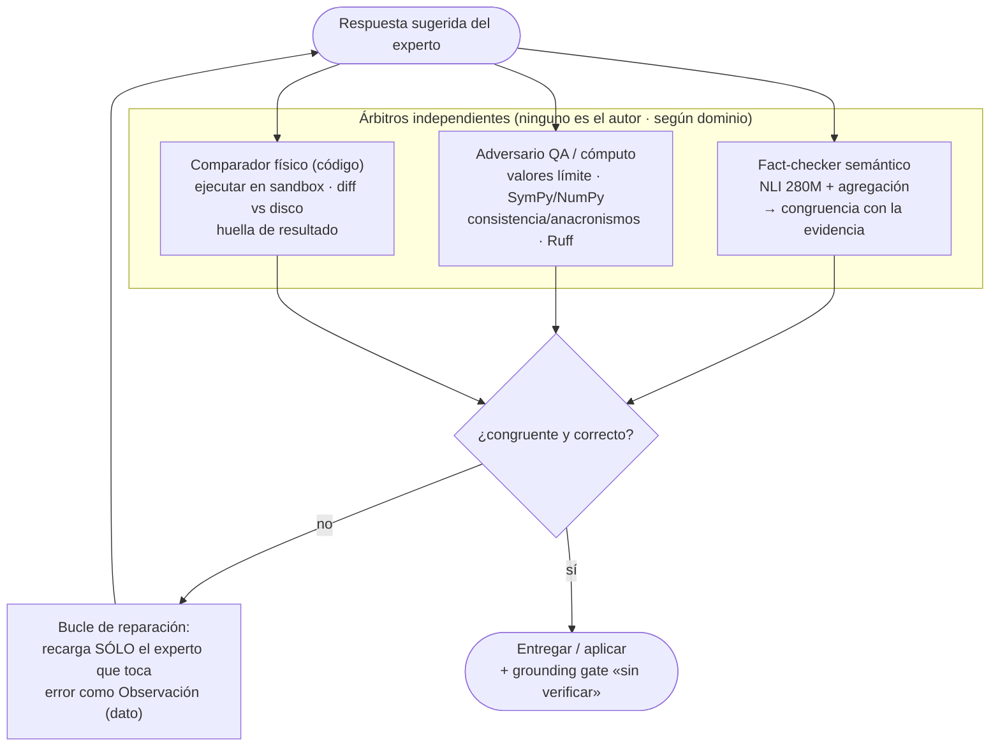
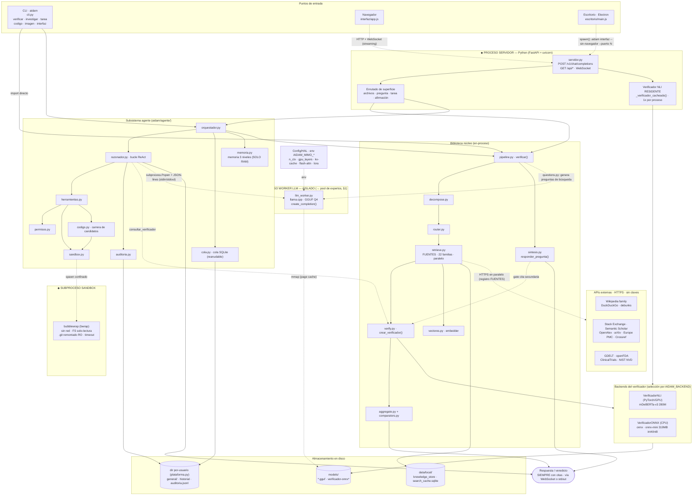

# AIDAM — diagramas de arquitectura (base del proyecto)

La **arquitectura canónica es el §1** (la visión del owner). Todos los demás
diagramas son el *detalle de sus cajas* — marcados **✅ construido** o
**🎯 objetivo**. Nos regimos por el §1; lo que existía antes se reusa solo
donde sirve para implementar esta arquitectura, no al revés.

Diagramas en **Mermaid** (texto plano): se renderizan solos en GitHub; para
editarlos visualmente pega cualquier bloque en <https://mermaid.live> (sin
registro) o impórtalo en <https://app.diagrams.net>. Los nodos citan módulos y
funciones reales (`aidam/…`). Roster de expertos y benchmarks por dominio:
[MULTI_SLM.md §11](MULTI_SLM.md).

Índice:
1. **Arquitectura canónica (visión del owner)** — perfil → router → experto → fact-checker → comparador → flywheel
2. Enrutamiento de la entrada (superficie de chat) ✅
3. Núcleo fact-checker: pipeline de verificación ✅
4. Modo respuesta (pregunta → respuesta citada) ✅
5. Bucle ReAct de tareas (el razonador) ✅
6. Árbitros por dominio (separación de poderes) 🎯
7. Bajo nivel: cableado actual (procesos, IPC, módulos, almacenes) ✅

---

## 1. Arquitectura canónica (visión del owner)

**La referencia del proyecto.** Perfil de hardware → router → experto
especializado → fact-checker → lógica comparativa → respuesta, más el flywheel
opt-in. Cuatro matices medidos del proyecto marcados con ★: (1) los dominios de
conocimiento = recuperación + razonador compartido, no un modelo memorizado;
(2) el «comparador» es lógica determinista auditable, no un modelo; (3) el
router-modelo debe ganarle al router de código (GATE ROUTE); (4) el
reentrenamiento promociona **solo si pasa** la batería, no al terminar. Roster
completo con modelos base y benchmarks: [MULTI_SLM.md §11](MULTI_SLM.md).

---

## 2. Enrutamiento de la entrada del usuario ✅

Detalle del bloque **Router** del §1: qué es cada entrada decide el camino.
Todo es código determinista y testeable; un falso positivo que robe una
afirmación al camino de verificación es el peor error, así que la detección es
conservadora.

---

## 3. Núcleo fact-checker: pipeline de verificación ✅

Detalle del bloque **Fact-checker CORE** del §1, ya construido y medido. Los
veredictos SÓLO salen de aquí (NLI + agregación), nunca de un LLM (medido:
LLM-como-único-juez 24% vs 58%).

---

## 4. Modo respuesta (pregunta → respuesta citada) ✅

Las preguntas se responden con la frase que responde, citada — nunca con un
veredicto. Fundamentado por construcción: cada palabra viene textual de una
fuente. La cita secundaria pasa por el NLI (corrección medida 2026-07-20).

---

## 5. Bucle ReAct de tareas (el razonador) ✅

Detalle del bloque **ReAct** del §1. El LLM elige la SIGUIENTE acción dentro de
límites impuestos por código (presupuesto, whitelist, permisos, sandbox,
auditoría por paso). La terminación la decide el código, no el modelo. Todo
pensamiento/acción/observación se MUESTRA. En la arquitectura objetivo, el
worker único se reemplaza por el experto que el router elige del pool (§1).

---

## 6. Árbitros por dominio (separación de poderes) 🎯

Detalle del **árbitro por dominio** del §1: ningún modelo evalúa su propio
trabajo. El árbitro cambia según el dominio (la columna «Árbitro AIDAM» del
roster) — sandbox para código, SymPy para matemáticas, recuperación+NLI para
conocimiento. Un fallo de cualquiera vuelve al bucle de reparación como
observación.

---

## 7. Bajo nivel: cableado actual ✅

Vista técnica de lo **construido hoy**: **fronteras de proceso** (recuadros
◆), **IPC/red** (flechas punteadas), **llamadas en-proceso** (sólidas),
**almacenes** (cilindros) y **APIs externas**. Refleja el código real
(`aidam/…`, `escritorio/…`). Tres procesos separados por diseño: Electron, el
servidor Python, y el worker LLM aislado (nació de una corrupción de heap
medida entre llama.cpp y PyTorch). **Estado vs §1:** hoy hay un worker
razonador único; la arquitectura objetivo lo sustituye por el pool de expertos
que el router selecciona por perfil.

